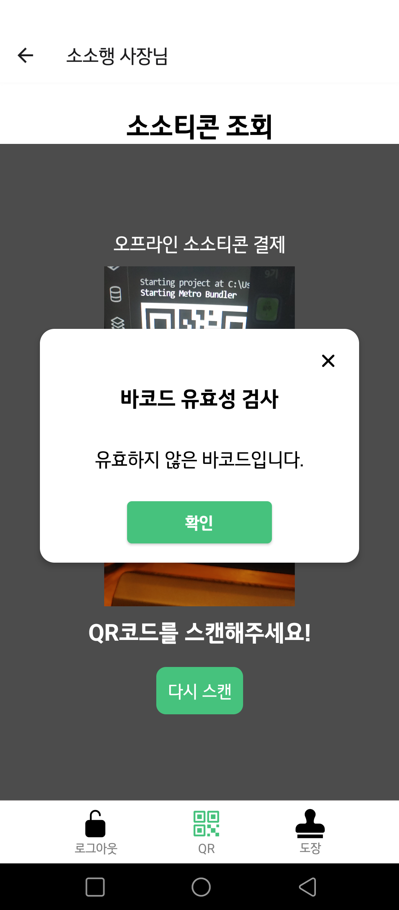
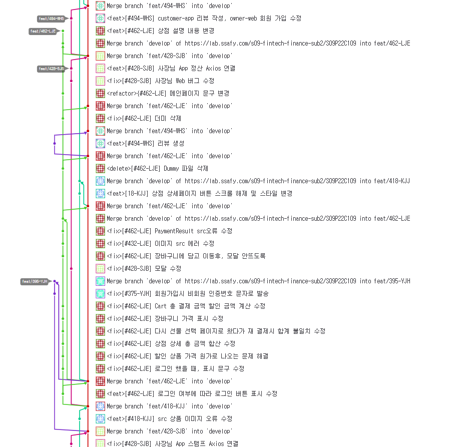

 

### 소상공인에게 소소한 행복을,

### 소중한 분에게 소소한 행복을!

 

좋은 곳을 갔을 때 생각나는 사람이 있나요?
 
좋은 음식을 먹을 때 생각나는 사람이 있나요?

나만의 아지트인 카페, 같이 운동하고 싶은 스포츠, 특색있는 메뉴가 있는 시그니처 음식점까지!

#### 소중한 분에게 행복을 선물할 수 있는 모바일쿠폰 서비스,

 

**소소행**을 소개합니다. 😊

 
 

# 💝 소소행만의 특별한 기능

1. 사용자가 원하는 대로 커스터마이징 해서 선물가능한 **선물꾸러미**
2. 모바일쿠폰 소소티콘은 **분할결제**가 가능해요!
3. 나의 소소티콘 잔액을 쉽게 볼 수 있어요.
4. 선물을 주고받은 추억을 **"너랑나랑"** 을 통해 보관할 수 있어요.
5. 소상공인 사장님을 위해 수수료를 2~3%로 반영했어요.
6. 인기순, 가격순이 아닌 **해시태그 키워드**를 통한 상점 검색
7. 상점별 종이 쿠폰을 대체할 모바일 스탬프쿠폰 **"소복소복"**

 

## 목차

#### [1️⃣개요](#개요)

#### [2️⃣팀 소개](#-팀-소개)

#### [3️⃣기획배경 및 타겟](#-기획배경-및-타겟)

#### [4️⃣파트별 기능구현 소개](#파트별-기능구현-소개)

#### [5️⃣서비스화면](#서비스화면)

#### [6️⃣사용기술스택](#-사용기술스택)

#### [7️⃣시스템아키텍쳐](#-시스템-아키텍쳐)

#### [8️⃣산출물](#-산출물)

#### [9️⃣협업툴](#-협업툴)

 

## 개요

- 기간 : 2023.08.21. ~ 2023.10.06.

- SSAFY 9기 특화PJT 핀테크 프로젝트

 

## ✨ 팀 소개

|   **Name**   |                                              이지은                                              |                                              김진주                                              |                                              서정빈                                              |                                              이민규                                              |                                              위효선                                              |                                              양지혜                                              |
| :----------: | :----------------------------------------------------------------------------------------------: | :----------------------------------------------------------------------------------------------: | :----------------------------------------------------------------------------------------------: | :----------------------------------------------------------------------------------------------: | :----------------------------------------------------------------------------------------------: | :----------------------------------------------------------------------------------------------: |
| **Profile**  |  |  |  |  |  |  |
| **Position** |                                  **Leader   Frontend App**                                   |                                     **Frontend Web/App**                                     |                                     **Frontend Web/App**                                     |                                     **Backend Release**                                      |                                           **Backend**                                            |                                           **Backend**                                            |

 

## 기획배경 및 타겟

 
- 기획 배경

    1. 성장하는 모바일 쿠폰 시장과 비합리적인 모바일 쿠폰 발행 구조
    2. 모바일 쿠폰의 높은 수수료 부담과 플랫폼 이용의 어려움
    3. 다양한 선택지와 만료 알림, 분할 결제 등의 기능에 대한 소비자의 요구

 
- 타겟층

    - 모바일 쿠폰을 통해 홍보 및 매출 상승을 원하는 영세업자·소상공인
    - 다양한 선택지와 더 편리한 기능을 원하는 소비자

 
- 서비스 소개

    - 소비자 : 앱을 통해 다양한 상점과 상품 조회, 선물 구매 및 관리, 그리고 편리하게 결제
    - 사장님 : 웹을 통해 상점 정보 및 상품 등록을 통한 소소티콘 발행, 소소티콘 매출 관리 / 앱을 통해 소소티콘 QRCode 스캔 및 사용금액 차감 기능을 통해 쉽게 거래를 처리
    - 비회원 : 문자 메세지를 통해 선물 받은 기프티콘 사용 가능

 

## 파트별 기능구현 소개

### 👩 사용자 어플리케이션

    - 사용자 회원가입, 로그인, 회원정보 조회, 회원정보 수정, 비밀번호 찾기
    - 업종별 상점 조회, 위치별 상점 조회, 상점 세부사항 조회
    - 상품 검색 및 상품 상세조회
    - 선물 선택, 구매, 결제
    - 장바구니 추가, 수량수정, 삭제
    - 선물카드 작성, 아임포트 결제
    - 받은 선물함, 소소티콘 사용가능 및 만료 조회
    - 마이페이지 (상점 찜 목록, 구매내역 조회)
    - 너랑나랑 (주고받은 내역)
    - 소소티콘 사용, 사용가능금액 확인, 이용완료 후 후기작성

### 👨 사장님 어플리케이션

    - 소소티콘 QRCode 스캔기능
    - 소소티콘 사용금액 차감

### 👨 사장님 웹페이지

    - 사업자등록번호 조회 및 회원가입
    - 상점 등록(상점 정보, 상품 정보) 및 수정
    - 소소티콘 관리 (매출내역 관리)
    - 이벤트성 소소티콘 발행

<!-- 예시
### Front-end (수정해야 함)
    - react-qr 이용하여 QR코드 카메라 인식
    - 지도API 연동
    - IMPORT 연동 r
    - KakaoMap을 이용하여 키오스크 현황 제공
    - D3.js를 이용하여 관리자 통계정보 제공 (수익추이, 사용횟수, 사용자별 이용내역, 사용자 계정정보 관리)
    - Back-end에서 제공한 JWT 토큰을 이용해서 로그인 구현

### Back-end
    - JWT토큰을 이용한 회원가입, 로그인, 회원정보 조회, 회원정보 수정, 회원탈퇴, 아이디 찾기, 비밀번호 찾기 구현 (사용자, 사장님)
    - 사장님 페이지에 매출관리 기능제공 (일별 및 월별 수익현황 등)
    - 상점, 상품, 장바구니. 주문, 결제, 키워드, 찜, 후기 등 구현
    - Zxing, UUID 를 이용한 QRCode, 소소티콘 생성
    - Amazon S3 를 이용한 QRCode이미지 업로드(보안의 측면)
    - Swagger/OpenAPI를 이용하여 API 명세서 구현
 -->

 

## 사용기술스택

- Front-End-App
  - React-Native
  - Expo
  - Iamport
- Front-End-Web
  - React
  - styled-components
  - react-bootstrap
- Backend
  - Database: MariaDB
  - Web: SpringBoot
- CI/CD
  - Docker
  - Jenkins
  - Nginx
- Server
  - AWS EC2

 

| Tech         | Stack                |
| ------------ | -------------------- |
| **Language** | JavaScript, Java     |
| **Backend**  | Java SpringBoot      |
| **Frontend** | React, React-Native  |
| **Database** | MariaDB              |
| **Server**   | AWS EC2              |
| **DevOps**   | Git, Docker, Jenkins |

 

## 시스템아키텍쳐

 

 

## 서비스화면

1. 사용자 앱

|                     메인                      |                  지도                   |                  검색                   |                카테고리 목록                |
| :-------------------------------------------: | :-------------------------------------: | :-------------------------------------: | :---------------------------------------------: |
|  |  |  |  |

|                  키워드                   |                  장바구니                   |                  너랑나랑                   |                  받은 선물함                  |
| :---------------------------------------: | :-----------------------------------------: | :-----------------------------------------: | :-------------------------------------------: |
|  |  |  |  |

|                  마이페이지                   |                  찜 목록                  |                  구매내역                   |                  상점상세                   |
| :-------------------------------------------: | :---------------------------------------: | :-----------------------------------------: | :-----------------------------------------: |
|  |  |  |  |

 
 
2. 사장님 앱

| 큐알코드 | 큐알유효성검사 | 사용자조회 |
| :---------: | :-----------: |:-----------: |
| |  |  |

| 소소티콘사용 | 스탬프조회 | 스탬프적립 |
| :---------: | :---------: | :---------: |
|  |  |  |

 
 
3. 사장님 웹

| 메인페이지 | 상점정보수정 | 
| :---------: | :-----------: |
| |  |

|상품관리 | 매출관리 |
| :---------: | :-----------: |
|  | |

 

## 산출물

### PPT

[특화PJT_광주_1반_C109_발표자료.pptx](./exec/특화PJT_광주_1반_C109_발표자료.pptx) (\*.pptx)

### 포팅 매뉴얼

 

## 협업툴

|                GITLAB                 |                 JIRA                  |
| :-----------------------------------: | :-----------------------------------: |
|  |  |

